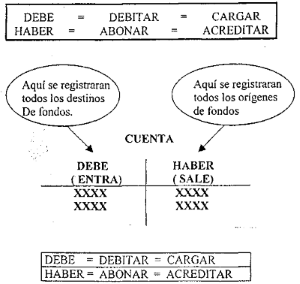

## Ecuacion de la contabilidad 
```
ACTIVO + GASTOS = PASIVO + CAPITAL + INGRESOS
```
### Cuentas reales o de balance.
  Son aquellas que reflejan informaci&oacute;n relacionada con la 
  situac&oacute;in financiera de una empresa a una determinada fecha. 
  Son informes est&aacute;ticos.
*  **Activos**
*  **Pasivos**
*  **Patrimonio**  

### Cuentas nominales o de resultado.  
  Estas cuentas relfejan el movimiento econ&oacute;mico de la empresa en un 
  determinado periodo de tiempo. El resultado que arroja un negocio puede
  ser PERDIDA o GANANCIA, el cual se lo determina a trav&eacute;s de los
  INGRESOS y EGRESOS ocurrido en un determinado tiempo dado.
*  **Ingresos**
*  **Egresos** Son los gastos.  

### Cuentas de orden.

### Partes de una cuenta:  
  Una cuenta esta formada por un lado izquierdo llamado DEBE y un lado 
  derecho llamado HABER. Donde anotar en el Debe significa DEBITAR o 
  CARGAR y anotar en el Haber significa ABONAR o ACREDITAR
```
DEBE = DEBITAR = CARGAR
HABER = ABONAR = ACREDITAR
```

## Saldos de las cuentas  
  El saldo de una cuenta es el sobrante o residuo de la diferencia entre el debe
  y el haber o d&eacute;bitos con Cr&eacute;ditos.
  *  **Saldo deudor** si el debe es mayor que el haber.
  *  **Saldo acreedor** Si el haber es mayor que el debe. 

      <table>
        <tr>
            <th colspan="2">Activo + Gastos o Egresos</th>
            <th>=</th>
            <th colspan="2"> Pasivos + Ingresos + Patrimonio</th>
        </tr>
        <tr>
            <td colspan="2">Cuentas con saldo deudor</td>
            <td>&nbsp;</td>
            <td colspan="2">Cuentas con saldo acreedor</td>
        </tr>
        <tr>
            <td>Debe</td> <td>Haber</td><td>&nbsp;</td><td>Debe</td> <td>Haber</td>
        </tr>
        <tr> 
            <td>Aumenta</td><td>Disminuye</td><td></td><td>Disminuye</td><td>Aumenta</td>
        </tr>
      </table>
